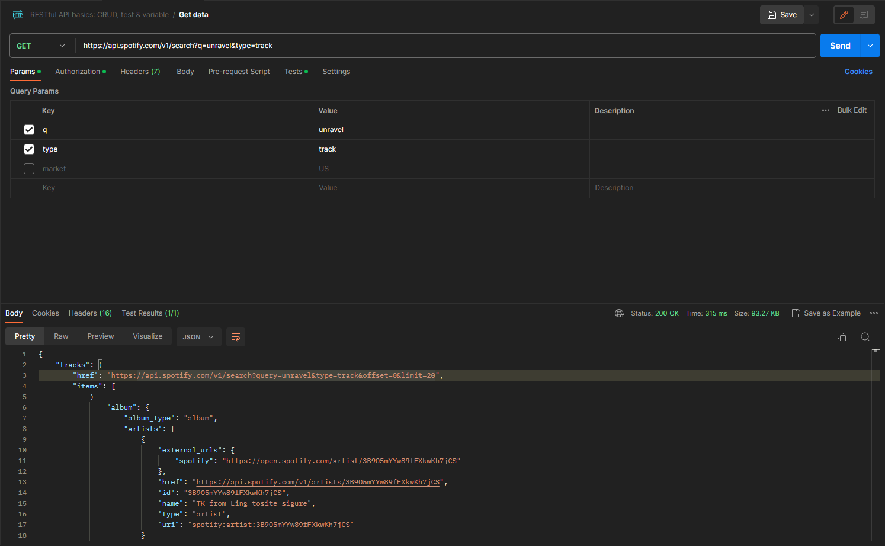

# CSC207group156
## Group Members:
//note: I think should we put our full names since this is an official submission
- Abhishek Sharma
- Ethan Fine
- Aria Coventry
- Xinze Wang
- Mahek Cheema

## Problem Domain
The goal of our group's project is to develop a YouTube-Spotify Playlist Converter. This project will facilitate 
seamless playlist transfers from YouTube to Spotify and Spotify to YouTube. Also, it will feature several other side tools for managing your playlist. As a result, the problem domain primarily involves media streaming 
and playlist management.

## Application Description
For customers who want to transfer their YouTube playlists to Spotify or Spotify playlists to YouTube, our program strives to offer a simple and 
effective alternative. The application's fundamental features will consist of:
- **Playlist Retrieval:** Users provide a YouTube/Spotify playlist URL, and the application will extract the list of songs from that playlist and create a playlist object.
- **Account Authentication:** User account authentication will be used to create playlists on behalf of the user.
- **Playlist Creation:** Our application will create a new Spotify/YouTube playlist for the user, depending on the application selected.
- **Song Retrieval:** Use a song+creator matching algorithm to search and match songs or podcasts from the YouTube playlist to the Spotify database, or from the Spotify playlist to YouTube's catalog.
- **Playlist Creation:** Retrieved songs will be added to the newly created Spotify/YouTube playlist, or the users can export the playlist object as a save file.
- **Other side tools:** Other possible features we may add are manually reordering playlist, auto-sorting, downloading mp3s, prompting user to select a similar match if original song+creator address was not found in the conversion recipient's database

## API usage documentation links
- **Spotify API:** (for PUT/GET requests for the user's spotify account)
https://developer.spotify.com/documentation/web-api
- **YouTube API:** (for PUT/GET requests for the user's youtube account)
https://developers.google.com/youtube/v3/getting-started
- **MusicAPI API:** (for GET requests to get youtube/spotify song data URLs to translate into a media object)
https://musicapi.com/docs/intro/

## API usage example: screenshot from Postman


## Technical problems blocking progress
MusicAPI has a request limit unless we pay for better access. We may decide not to use this and instead access the song database from url requests via YouTube/Spotify directly.


## Java Code Output 

The Spotify API has a neccessary feature that needs a access token prior to making API calls, the first method
under the Spotify class is a POST method that makes a POST request with all the valid information that is needed 
to generate an access code.

The second method is not a POST request but a GET request, it's used to make API calls for various different details such as 
but not limited to artist details, trending charts, and even user data if the user makes it accessible. 

Below is the output of method 1 generating the access code and method 2 making a method call with the artist set to as 
Drake. 

```json
{
  "access_token":"BQCMVlqXGrPTbw6sekbN4CwJfYyYUxS5kIjQltIJnbNZL-thgE_XLyHiwD7cdc-Xn9IthGII-zCrJ80FDNAS9E8ODi9HZjmrx_LX9J1WvssDONnQtR4",
  "token_type":"Bearer",
  "expires_in":3600
}

```


```json
{
    "external_urls": {
        "spotify": "https://open.spotify.com/artist/3TVXtAsR1Inumwj472S9r4"
    },
    "followers": {
        "href": null,
        "total": 80293785
    },
    "genres": [
        "canadian hip hop",
        "canadian pop",
        "hip hop",
        "pop rap",
        "rap"
    ],
    "href": "https://api.spotify.com/v1/artists/3TVXtAsR1Inumwj472S9r4",
    "id": "3TVXtAsR1Inumwj472S9r4",
    "images": [
        {
            "height": 640,
            "url": "https://i.scdn.co/image/ab6761610000e5eb4293385d324db8558179afd9",
            "width": 640
        },
        {
            "height": 320,
            "url": "https://i.scdn.co/image/ab676161000051744293385d324db8558179afd9",
            "width": 320
        },
        {
            "height": 160,
            "url": "https://i.scdn.co/image/ab6761610000f1784293385d324db8558179afd9",
            "width": 160
        }
    ],
    "name": "Drake",
    "popularity": 95,
    "type": "artist",
    "uri": "spotify:artist:3TVXtAsR1Inumwj472S9r4"
}
```
